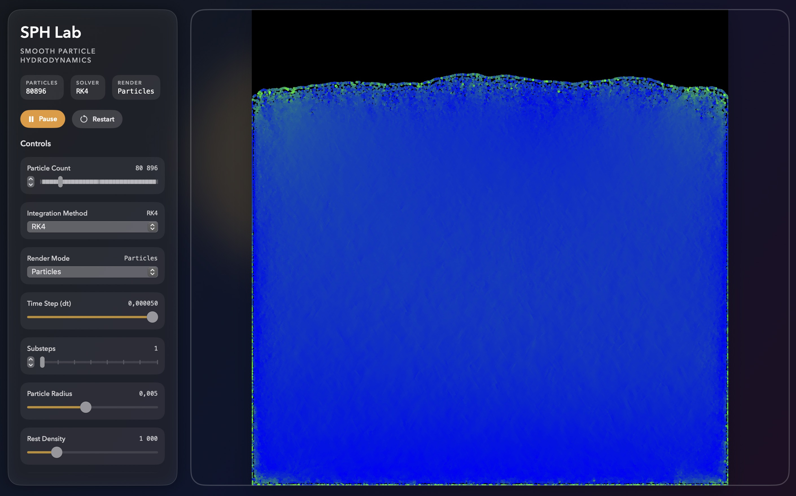
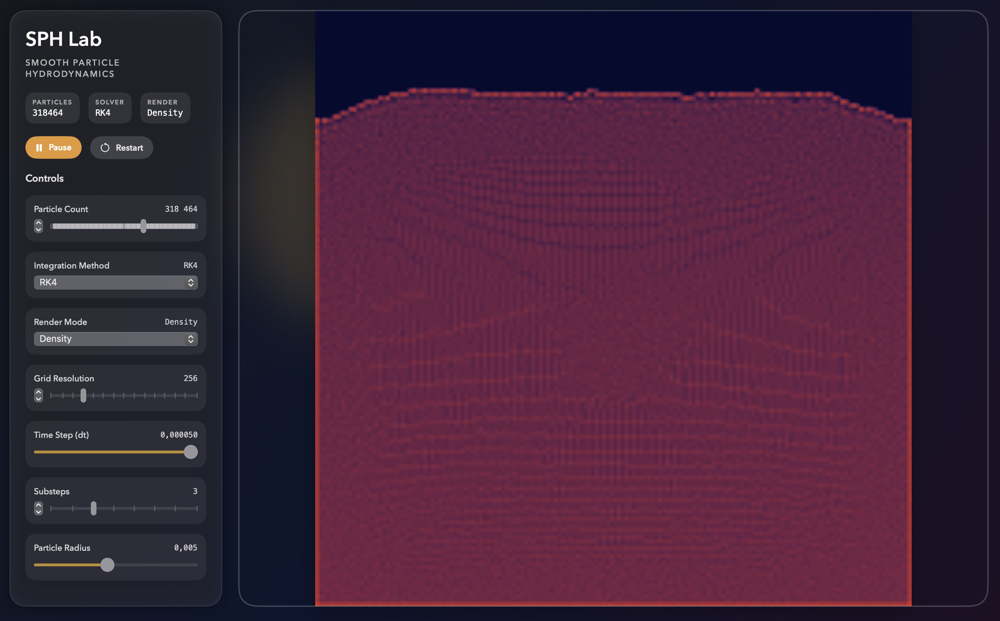

# SPH Fluid Simulation in Metal

This repository contains an **educational** Smooth Particle Hydrodynamics (SPH) fluid simulation written in **Metal** and wrapped in a **SwiftUI** app. It demonstrates a real-time 2D SPH solver with GPU compute, a modern control panel, and multiple visualization modes.

## Table of Contents
- [SPH Fluid Simulation in Metal](#sph-fluid-simulation-in-metal)
  - [Table of Contents](#table-of-contents)
  - [Overview](#overview)
    - [What is SPH?](#what-is-sph)
  - [Screenshots](#screenshots)
    - [Why Metal?](#why-metal)
  - [Features](#features)
  - [Requirements](#requirements)
  - [Build and Run](#build-and-run)
  - [Usage](#usage)
  - [Project Structure](#project-structure)
  - [TODO](#todo)
  - [License](#license)
  - [References](#references)

---

## Overview

### What is SPH?

**Smooth Particle Hydrodynamics (SPH)** is a computational method for simulating fluid flows. Unlike grid-based approaches, SPH represents fluids as a collection of discrete particles making it especially useful for free surface flow and complex boundary interactions. This method uses a **Lagrangian** point of view, in contrast to the **Eulerian** framework found in many grid based simulations.

This project leverages **Metal** to perform computations directly on Apple GPUs, ensuring highly efficient simulations on compatible macOS and iOS devices.

## Screenshots




### Why Metal?

[Metal](https://developer.apple.com/metal/) is a low level, low overhead hardware accelerated 3D graphic and compute shader API created by Apple. By using Metal, we can:
- Exploit the full capabilities of Apple GPUs.
- Achieve better performance over higher-level APIs.
- Have more control over memory and rendering pipelines.

---

## Features

- **GPU-based SPH solver** with per-frame compute pipelines for density, forces, and integration.
- **Spatial hashing with Morton codes + radix sort** to build cell ranges for neighbor search.
- **Multiple integrators**: RK4, RK2, predictor-corrector, and Verlet.
- **Render modes**: particle sprites, density field, and velocity field.
- **SwiftUI control panel** for particle count, timestep, viscosity, stiffness, and more.

---

## Requirements

- **macOS** with a Metal-capable GPU.
- **Xcode** with SwiftUI + Metal support (Xcode 14+ recommended).

---

## Build and Run

1. Open the repository in Xcode.
2. Select the macOS target.
3. Press **Cmd + R** to build and run.

---

## Usage

1. Run the app in Xcode. You will see the simulation surface and a control panel.
2. Use the controls to tweak particle count (1,024 to 500,000), timestep, substeps, integration method, and render mode.
3. If you change particle count or particle radius, the simulation rebuilds buffers and restarts.

---

## Project Structure

```
SPH
├── SPHApp.swift                     // SwiftUI app entry point
├── SwiftUI View/                    // UI and MTKView bridge
│   ├── ContentView.swift
│   ├── ControlPanel.swift
│   ├── SimulationSurface.swift
│   └── MetalView.swift
├── Control/                         // Renderer + camera
│   ├── Renderer.swift
│   └── Camera.swift
├── Render/                          // Render passes and pipelines
│   ├── PhysicRenderPass.swift
│   ├── PhysicRenderPass+RK4.swift
│   ├── PhysicRenderPass+RK2.swift
│   ├── PhysicRenderPass+Verlet.swift
│   └── GraphicRenderPass.swift
├── Shaders/                         // Metal compute + render kernels
├── Geometry/                        // Quad model + transforms
└── Utility/                         // Math helpers
```

## TODO
- [ ] Extend the simulation from **2D** to **3D**.
- [ ] Add **multi-platform support for iOS**.
- [ ] Add boundary shapes and emitters.
- [ ] Improve stability for extreme particle counts and timesteps.

---

## License

This project is licensed under the [MIT License](LICENSE). You are free to use, modify, and distribute this software. See the [LICENSE](LICENSE) file for details.

---

## References

- [Apple Metal Documentation](https://developer.apple.com/metal/)  
  Comprehensive official documentation for Apple’s Metal API, covering topics on graphics rendering and GPU-based computation.

- [Smooth Particle Hydrodynamics (SPH) Tutorial](https://sph-tutorial.physics-simulation.org/pdf/SPH_Tutorial.pdf)  
  A detailed tutorial on SPH theory and its practical implementations. This document serves as an excellent starting point for understanding the fundamentals of SPH.

- [NVIDIA CUDA Particles Simulation Guide (Archived)](https://web.archive.org/web/20140725014123/https://docs.nvidia.com/cuda/samples/5_Simulations/particles/doc/particles.pdf)  
  A technical guide from NVIDIA showcasing SPH particle simulation using CUDA. Though focused on CUDA, the principles can be adapted to other GPU frameworks like Metal.

- [Position Based Fluids (2005)](http://www.ligum.umontreal.ca/Clavet-2005-PVFS/pvfs.pdf)  
  A seminal paper by Matthias Müller et al. introducing Position-Based Fluids (PBF), a simplified yet effective approach to fluid simulation often used alongside SPH.
