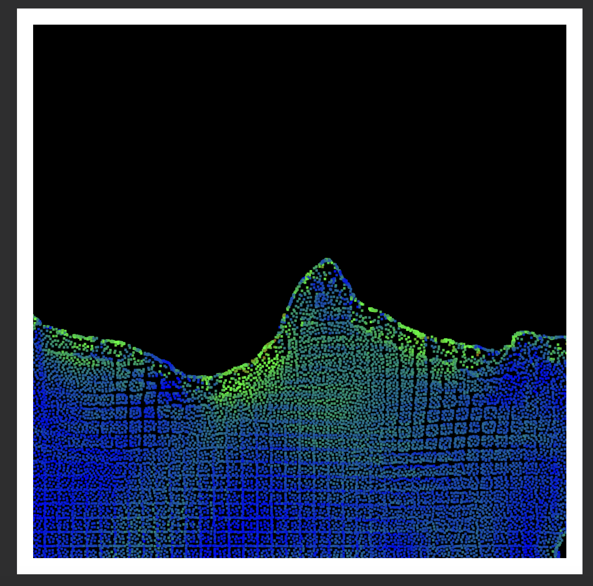
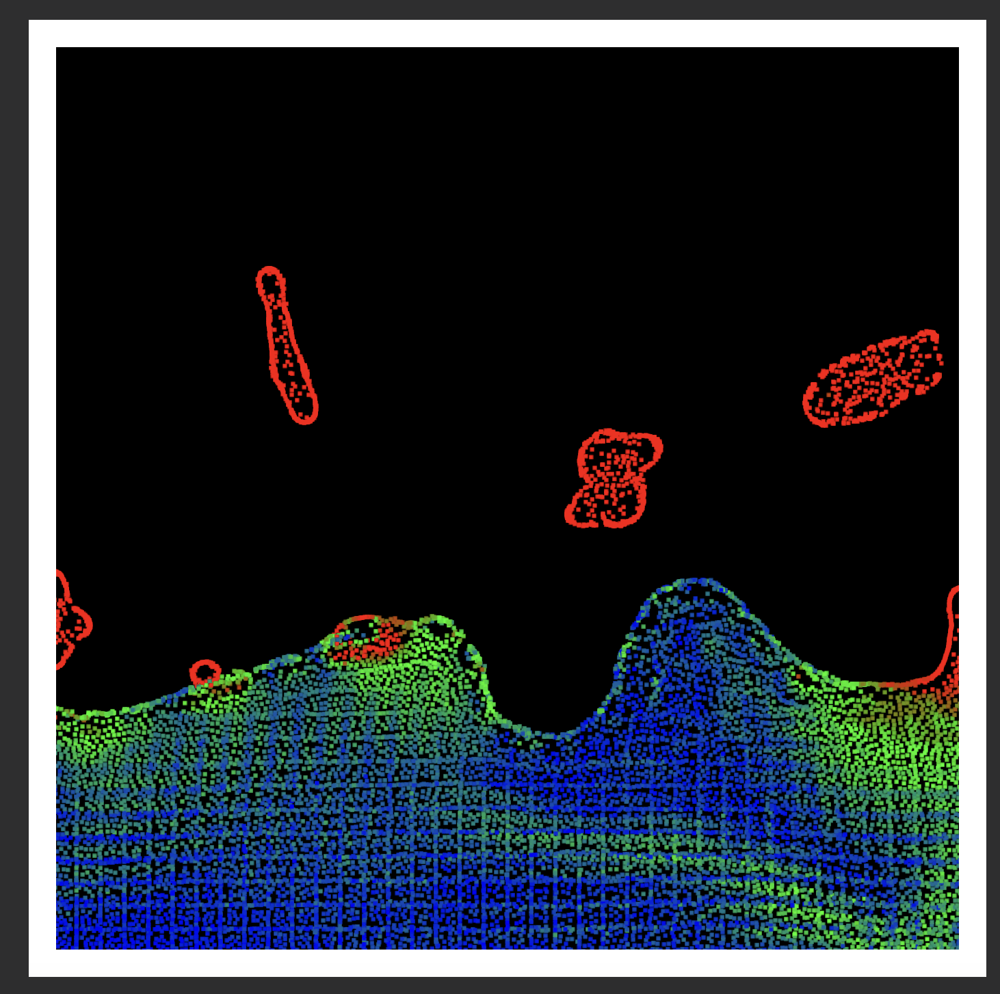

# SPH Fluid Simulation in Metal

This repository contains an **educational** Smooth Particle Hydrodynamics (SPH) fluid simulation project written in **Metal**, Apple’s GPU programming framework. The objective is to demonstrate the fundamentals of SPH and provide a starting point for anyone looking to learn or experiment with GPU-accelerated particle-based fluid simulations on Apple platforms.

Fast simulation of up to 16,384 (2^14) particles using GPU acceleration.

## Table of Contents
- [SPH Fluid Simulation in Metal](#sph-fluid-simulation-in-metal)
  - [Table of Contents](#table-of-contents)
  - [Overview](#overview)
    - [What is SPH?](#what-is-sph)
  - [Screenshots](#screenshots)
    - [Why Metal?](#why-metal)
  - [Features](#features)
  - [Requirements](#requirements)
  - [Installation and Setup](#installation-and-setup)
  - [Usage](#usage)
  - [TODO](#todo)
  - [Project Structure](#project-structure)
  - [Contributing](#contributing)
  - [License](#license)
  - [References](#references)

---

## Overview

### What is SPH?

**Smooth Particle Hydrodynamics (SPH)** is a computational method for simulating fluid flows. Unlike grid-based approaches, SPH represents fluids as a collection of discrete particles—making it especially useful for free-surface flow and complex boundary interactions. This method uses a **Lagrangian** point of view, in contrast to the **Eulerian** framework found in many grid-based simulations. While SPH tends to be more suitable for real-time applications, it can be less precise than methods like Finite Element Analysis (FEA).

This project leverages **Metal** to perform computations directly on Apple GPUs, ensuring highly efficient simulations on compatible macOS and iOS devices.

## Screenshots

<div align="center">
  
  
</div>

### Why Metal?

[Metal](https://developer.apple.com/metal/) is a low-level, low-overhead hardware-accelerated 3D graphic and compute shader API created by Apple. By using Metal, we can:
- Exploit the full capabilities of Apple GPUs.
- Achieve better performance over higher-level APIs.
- Have more control over memory and rendering pipelines.

---

## Features

- **Particle-based fluid simulation** using SPH.
- **GPU-accelerated** calculations for neighbor searches, particle interactions, and rendering.
- **Real-time visualization** of fluid behavior.

---

## Requirements

- **macOS 11 (Big Sur)** or later, or **iOS 14** or later (for iOS build).
- **Xcode 13** or later (recommended).
- A device that supports **Metal** (macOS, iPhone, or iPad).

---

## Installation and Setup

1. **Clone the repository**:
   ```bash
   git clone https://github.com/Pierre-Joly/SPH-Fluid-Metal-GPU.git
   cd SPH-Fluid-Metal-GPU
   ```

2. **Open the project in Xcode**:
   - Double-click `SPH-Fluid-Metal-GPU.xcodeproj` (or `SPH-Fluid-Metal-GPU.xcworkspace` if provided).
   
3. **Select your target**:
   - For macOS, choose the **MyMac** scheme (or a similar Mac scheme in Xcode).
   - For iOS, select an **iOS device** or **Simulator** scheme.
   
4. **Build and run**:
   - Press **Cmd + R** in Xcode to build and run the application.

---

## Usage

1. **Run the app** in Xcode. You will see a window (or iOS simulator) displaying the fluid particles moving according to SPH rules.
2. **Adjust parameters** (like particle count, smoothing radius, etc.) inside the code or configuration files if needed. You can experiment with different values to observe changes in fluid behavior.
3. **Interact** with the simulation:
   - On macOS, you may be able to rotate, pan, or zoom the view (depending on the current implementation).
   - On iOS, use touch gestures to interact with the simulation if implemented.

---

## TODO
- [ ] Transition from a **grid-based neighbor search** to a **hash-based neighbor search** using Morton codes.  
  *Implementing Radix Sort or Bitonic Sort will be required for this step.*
- [ ] Extend the simulation from **2D** to **3D**.
- [ ] Add **multi-platform support for iOS**.
- [ ] Add a UI to allow easy customization of parameters.

---

## Project Structure

A typical structure for this repository might look like:

```
SPH-Fluid-Metal-GPU
├── SPH-Fluid-Metal-GPU
│   ├── AppDelegate.swift        // App delegate for macOS/iOS
│   ├── ViewController.swift     // Handles the main view and rendering
│   ├── MetalView.swift          // Custom Metal view for rendering
│   ├── SPHRenderer.swift        // Responsible for setting up Metal pipelines
│   ├── SPHSimulation.swift      // Core SPH logic
│   ├── Shaders.metal            // Metal shader functions (kernels)
│   └── ...                      // Additional source files
├── Images.xcassets              // Assets for icons, etc.
├── SPH-Fluid-Metal-GPU.xcodeproj
├── LICENSE                      // License information
└── README.md                    // Project documentation
```

- **SPH-Fluid-Metal-GPU**: Contains the main source code and resources.
- **Shaders.metal**: GPU kernels responsible for SPH computations and rendering.
- **SPHSimulation.swift**: Core SPH algorithms, calculations, and data structures.
- **SPHRenderer.swift**: Responsible for rendering code, pipeline setup, and draw calls.

---

## Contributing

Contributions are welcome! If you would like to contribute to this project:
1. **Fork** the repository.
2. **Create a new branch** for your feature or bug fix.
3. **Commit your changes** with clear messages.
4. **Open a pull request** describing the changes you made.

Please adhere to the existing style conventions and add relevant documentation where needed.

---

## License

This project is licensed under the [MIT License](LICENSE). You are free to use, modify, and distribute this software. See the [LICENSE](LICENSE) file for details.

---

## References

- [Apple Metal Documentation](https://developer.apple.com/metal/)  
  Comprehensive official documentation for Apple’s Metal API, covering topics on graphics rendering and GPU-based computation.

- [Smooth Particle Hydrodynamics (SPH) Tutorial](https://sph-tutorial.physics-simulation.org/pdf/SPH_Tutorial.pdf)  
  A detailed tutorial on SPH theory and its practical implementations. This document serves as an excellent starting point for understanding the fundamentals of SPH.

- [NVIDIA CUDA Particles Simulation Guide (Archived)](https://web.archive.org/web/20140725014123/https://docs.nvidia.com/cuda/samples/5_Simulations/particles/doc/particles.pdf)  
  A technical guide from NVIDIA showcasing SPH particle simulation using CUDA. Though focused on CUDA, the principles can be adapted to other GPU frameworks like Metal.

- [Position Based Fluids (2005)](http://www.ligum.umontreal.ca/Clavet-2005-PVFS/pvfs.pdf)  
  A seminal paper by Matthias Müller et al. introducing Position-Based Fluids (PBF), a simplified yet effective approach to fluid simulation often used alongside SPH.
